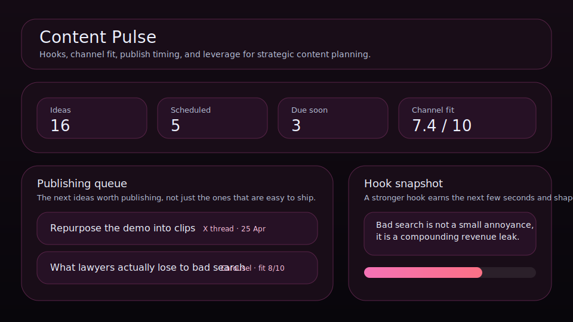

# Content Pulse

Plan, score, and evolve content ideas that actually support the business.



Content Pulse is a local-first publishing board for founders, operators, and solo creators who want a sharper way to decide what content deserves effort. It keeps hooks, channel fit, publish dates, and idea leverage visible so your content system feels strategic instead of random.

## What it does

- ranks ideas by leverage, channel fit, publish timing, and friction
- tracks **hook**, **channel**, **format**, **publish date**, and **channel fit** for each idea
- highlights the next publish slot, strongest current bet, and sharpest channel match
- includes quick actions for scheduling an idea, copying its hook, and marking it published
- renders a publishing queue and content mix snapshot beneath the main board
- saves locally in the browser with JSON import/export backups

## Why it feels different

Content Pulse is not a generic content calendar. It is designed for choosing the right idea first, sharpening its angle, and making sure what gets published actually supports the business.

## Quick start

```bash
git clone https://github.com/get2salam/content-pulse.git
cd content-pulse
python -m http.server 8000
```

Then open <http://localhost:8000>.

## Keyboard shortcuts

- `N` creates a new idea
- `/` focuses the search box

## Data shape

```json
{
  "boardTitle": "Content pulse board",
  "items": [
    {
      "title": "What lawyers actually lose to bad search",
      "category": "Insight",
      "state": "Promising",
      "score": 9,
      "channelFit": 8,
      "channel": "LinkedIn post",
      "format": "Carousel",
      "publishDate": "2026-04-27"
    }
  ]
}
```

## Privacy

Everything stays in your browser unless you export a JSON backup.

## License

MIT
